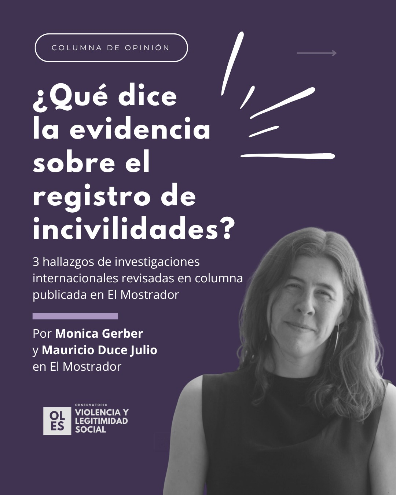
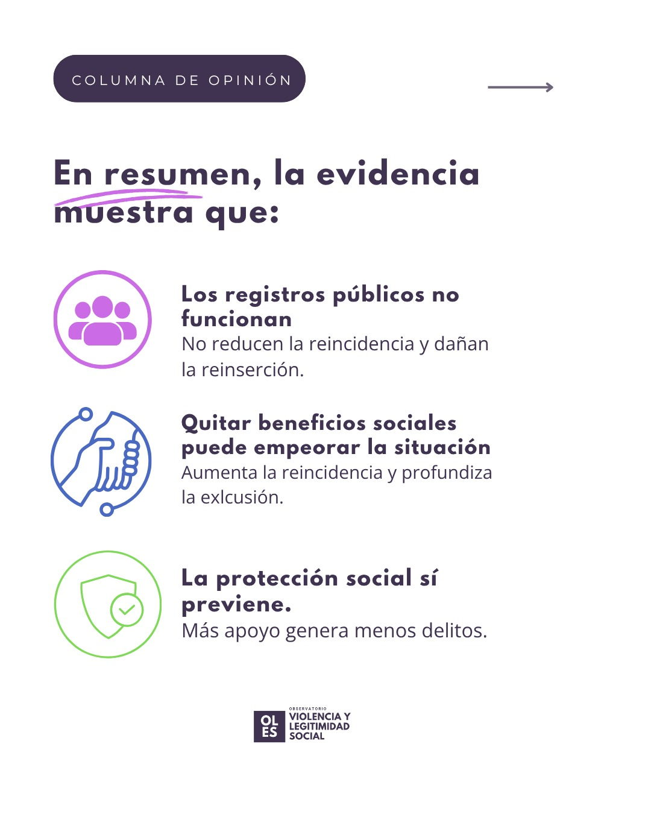

::: featured-image

:::
La directora ejecutiva del Observatorio de Violencia y Legitimidad Social (OLES), [Monica Gerber](../../equipo/monica-gerber.html), junto a Mauricio Duce Julio, publicaron una columna de opinión en El Mostrador en la que revisan la evidencia internacional disponible sobre el registro de incivilidades. Su conclusión: la política carece de respaldo empírico y sus efectos pueden ser contraproducentes.

## Los 4 hallazgos de la columna

### Hallazgo 1: La protección social previene el delito

Una revisión de decenas de estudios en Estados Unidos concluyó que ampliar la protección social —subsidios, asistencia en efectivo, seguro de salud— genera un "dividendo de prevención del delito", reduciendo tanto los delitos violentos como los contra la propiedad.

> *Apel, R. (2026). Can Social Safety Net Spending Prevent Crime? Annual Review of Criminology, 9, 101–125.*

### Hallazgo 2: Quitar beneficios como castigo aumenta la reincidencia

Un estudio analizó una ley que prohíbe de por vida el acceso a beneficios de alimentación a quienes fueron condenados por delitos de drogas. Perder el beneficio aumentó la reincidencia, en parte para recuperar los ingresos perdidos.

> *Tuttle, C. (2019). Snapping Back: Food Stamp Bans and Criminal Recidivism. American Economic Journal: Economic Policy, 11(2), 301–327.*

### Hallazgo 3: Los registros públicos no reducen la reincidencia

Un metaanálisis de 18 investigaciones que abarcó 475.000 personas estudiadas no encontró ningún efecto significativo sobre la reincidencia derivado de los registros públicos de infractores.

> *Zgoba, K. M., & Mitchell, M. M. (2021). The Effectiveness of Sex Offender Registration and Notification: A Meta-Analysis of 25 Years of Findings. Journal of Experimental Criminology, 19, 71–96.*

### Hallazgo 4: Los registros dañan la reinserción de las personas y sus familias

Un estudio mostró que figurar en un registro público se asocia a desempleo, problemas de vivienda y estigma para la persona condenada, y a depresión y ansiedad en sus hijos; factores que dificultan la reinserción.

> *Levenson, J. S., & Tewksbury, R. (2009). Collateral Damage: Family Members of Registered Sex Offenders. American Journal of Criminal Justice, 34(1–2), 54–68.*

## La columna completa

Estos hallazgos fueron desarrollados en la columna de opinión ["Un experimento social sin evidencia: el registro de incivilidades y sus consecuencias"](https://www.elmostrador.cl/noticias/opinion/columnas/2026/06/09/un-experimento-social-sin-evidencia-el-registro-de-incivilidades-y-sus-consecuencias/), publicada en El Mostrador.

::: featured-image

:::

[← Volver a Noticias](../index.html)
